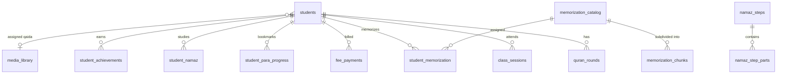

# Database Schema and PostgREST Query Limits

Quran Academy runs on Supabase (PostgreSQL 15+). Tables are partitioned conceptually into core entities, academic progress, curriculum materials, and administrative logs.

---

## 🗄️ Primary Relational Schema



### Table Summary
* **`profiles`:** Identity records linking Supabase Auth `auth.users(id)` to academy roles (`teacher`).
* **`students`:** Student identity, guardian information, scheduled class times (`"h:mm AM/PM PKT"`), and status.
* **`quran_rounds`:** Khatm and reading stages; stores `desc_completed` (countdown from 30) and `asc_completed`.
* **`student_para_progress`:** Real-time bookmarking for paras `0..30` (page, line, $(X,Y)$ pointer).
* **`class_sessions`:** Historic records of conducted 1-on-1 classes.
* **`fee_payments`:** Monthly tuition status ledger.
* **`media_library`:** Uploaded Quran and Qaida PDFs.
* **`memorization_catalog` & `chunks`:** Structured Hifz curriculum and sub-parts.
* **`namaz_steps` & `parts`:** Prayer postures and Arabic text.
* **`achievements` & `student_achievements`:** Gamification badges and milestone awards.
* **`activity_logs`:** High-resolution student portal audit stream.

---

## ⚠️ The PostgREST 1000-Row Truncation Invariant

PostgREST (the engine behind Supabase client queries) enforces an unconditional **default cap of 1,000 rows** on unfiltered queries.

> [!WARNING]
> Calling `.select("*")` without a pagination range on tables that grow over time (`quran_rounds`, `class_sessions`, `activity_logs`, or large `students` lists) **silently drops all records after the 1,000th row**.

### Mandatory Solution: `fetchAllRows`
```typescript
// src/lib/supabase.ts
const rounds = await fetchAllRows<QuranRound>("quran_rounds", (q) =>
  q.select("*").order("started_at", { ascending: true })
)
```
Always use `fetchAllRows` when querying unbounded tables from client components.
